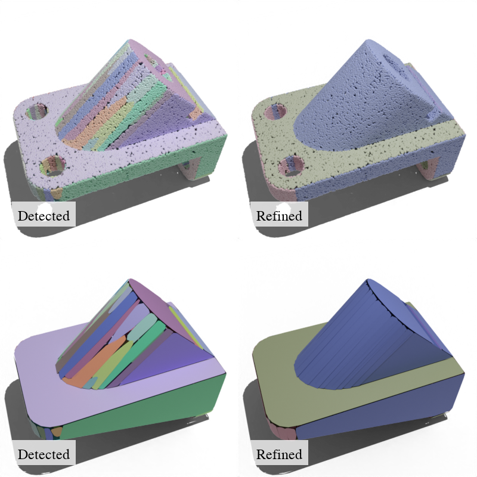
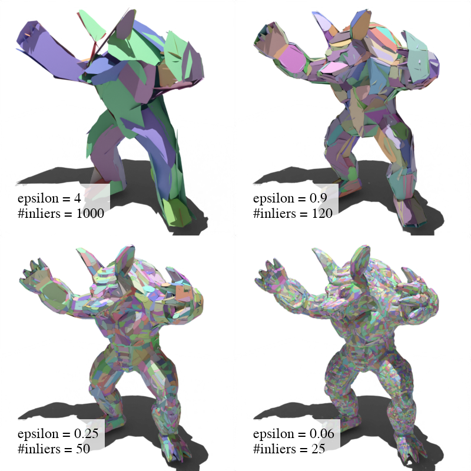
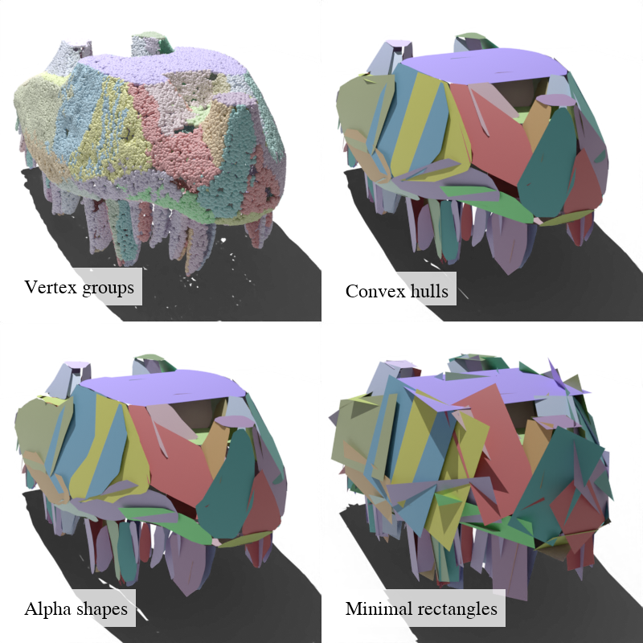

# PSDR: Planar shape detection and refinement


This repository contains a pipeline for planar shape detection [[1]](#book-references) and refinement [[2]](#book-references) from point clouds. 
The source code is written in C++ and Python bindings are provided for the main functionality.

<p float="left">
  
</p>

## :clipboard: Features

- Reading of point clouds (.ply) or vertex groups ([.vg](https://abspy.readthedocs.io/en/latest/vertexgroup.html), .npz) as input
- Planar shape detection based on a robust and efficient region growing algorithm [[1]](#book-references) (also in [CGAL](https://doc.cgal.org/latest/Shape_detection/index.html#Shape_detection_RegionGrowing))
- Planar shape refinement based on an optimization that seeks the best trade-off between fidelity, completeness and simplicity of the configuration [[2]](#book-references)
- Writing of planar shapes as 2D convex hulls, alpha shapes or minimal rectangles (.ply) or as vertex groups ([.vg](https://abspy.readthedocs.io/en/latest/vertexgroup.html), .npz ,.ply).

## :bricks: Installation

First, clone this repository and create a new conda environment called psdr. Then, install and test PSDR, its Python bindings and all necessary dependencies.

```
git clone https://github.com/raphaelsulzer/psdr.git
cd psdr
conda create --name psdr && conda activate psdr
conda install -y -c conda-forge xtensor xtensor-io spdlog cgal anaconda::mpfr yaml-cpp omnia::eigen3
# symlink eigen3/Eigen to Eigen (Windows only)
ln -s $CONDA_PREFIX/Library/include/eigen3/Eigen $CONDA_PREFIX/Library/include/Eigen
# symlink eigen3/Eigen to Eigen (Linux/MacOS only)
ln -s $CONDA_PREFIX/include/eigen3/Eigen $CONDA_PREFIX/include/Eigen
pip install psdr/.
python -m unittest test.py               
```

If all tests complete successfully you are ready to use PSDR.


## :computer: Usage


### Python

```
from pypsdr import psdr

# initialise a planar shape detector                                    
ps = psdr(verbosity=1)              

# load input point cloud                                         
ps.load_points("example/data/anchor/pointcloud.ply")

# detect planar shapes
ps.detect(epsilon=0.10,min_inliers=50,knn=10,normal_th=0.8)

# refine planar shape configuration until convergence (i.e. no limit on number of iterations)
ps.refine(max_iter=-1)

# export planar shapes
ps.save("example/data/anchor/convexes.ply","convex")                  
ps.save("example/data/anchor/rectangles.ply","rectangles")            
ps.save("example/data/anchor/alpha_shapes.ply","alpha")               
ps.save("example/data/anchor/point_groups.ply","pointcloud")               
ps.save("example/data/anchor/point_groups.vg")                              
ps.save("example/data/anchor/point_groups.npz")                              
```
For more Python examples see the `example/python` folder.

### C++

```
auto SD = Shape_Detector();
SD.load_points(example/data/anchor/pointcloud.ply);
SD.set_detection_parameters(20,0.02,0.8,10);
auto SC = Shape_Container(&SD);
SC.detect();
SC.refine(10);
SC.save("example/data/gargoyle/groups.npz");
SC.save("example/data/gargoyle/rectangles.ply","rectangle");
```
For a cmake project that uses PSDR see the `example/cpp` folder.


## :camera_flash: Examples

### Refinement
<p float="left">
  
</p>

### Levels of detail
<p float="left">
  
</p>

### Representations
<p float="left">
  
</p>

## :book: References

```bibtex
@article{1,
  title={Creating large-scale city models from 3D-point clouds: a robust approach with hybrid representation},
  author={Lafarge, Florent and Mallet, Cl{\'e}ment},
  journal={International journal of computer vision},
  volume={99},
  pages={69--85},
  year={2012},
  publisher={Springer}
}
```

```bibtex
@inproceedings{2,
  title={Finding Good Configurations of Planar Primitives in Unorganized Point Clouds},
  author={Yu, Mulin and Lafarge, Florent},
  booktitle={Proceedings of the IEEE/CVF Conference on Computer Vision and Pattern Recognition},
  pages={6367--6376},
  year={2022}
}
```

## Citation

If you use this library in your work, please consider citing the above papers and this repository:
```bibtex
@misc{sulzer2023psdr,
  author = {Sulzer, Raphael},
  title = {PSDR: Planar shape detection and refinement},
  year = {2023},
  howpublished = {GitHub Repository},
  url = {https://github.com/raphaelsulzer/psdr}
}
```

