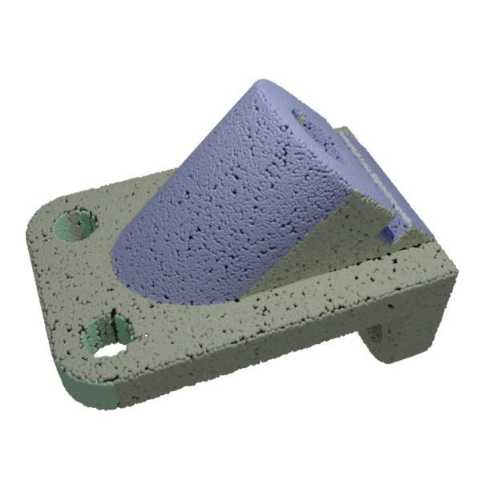
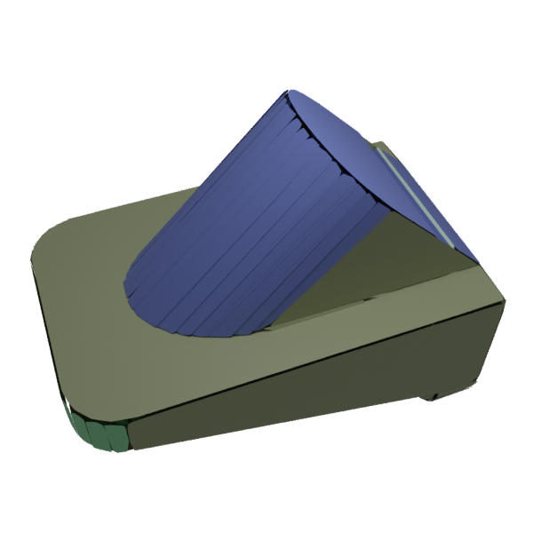

# PSDR: Planar shape detection and refinement


<p float="left">
  
  
</p>
City 


This repository contains a pipeline for planar shape detection [[1]](#references) and refinement [[2]](#references) from point clouds. The source code is written in C++. We also provide Python bindings for the main functionality.

# Features


- Reading of point clouds (.ply) or vertex groups ([.vg](https://abspy.readthedocs.io/en/latest/vertexgroup.html), .npz) as input
- Planar shape detection based on a robust and efficient region growing algorithm [[1]](#references) (also implemented in CGAL)
- Planar shape refinement based on an optimization finding the best trade-off between fidelity, completeness and simplicity of the configuration [[2]](#references)
- Writing of planar shapes as 2D convex hulls, alpha shapes or minimal rectangles (.ply) or as vertex groups ([.vg](https://abspy.readthedocs.io/en/latest/vertexgroup.html), .npz).

# Installation

Simply clone the repository and install in a new conda environment using pip:

```
git clone https://github.com/raphaelsulzer/psdr.git
cd psdr
conda create --name psdr
conda activate psdr
pip install . 
```

You are now ready to use PSDR.


# Usage


## Python

```
from pypsdr import psdr

# initialise a planar shape detector and load input points                                              
ps = psdr(verbosity=1)                                               
ps.load_points(example/data/anchor/pointcloud.ply)

# detect planar shapes with default values
ps.detect(min_inliers=20,epsilon=0.02,normal_th=0.8,knn=10)

# refine planar shape configuration until convergence (i.e. no limit on number of iterations)
ps.refine(max_iter=-1)

# export planar shapes and vertex groups  
ps.save(example/data/anchor/convexes.ply,"convex")                  
ps.save(example/data/anchor/rectangles.ply,"rectangles")            
ps.save(example/data/anchor/alpha_shapes.ply,"alpha")               
ps.save(example/data/anchor/groups.vg)                              
ps.save(example/data/anchor/groups.npz)                             
```


## C++

See `example/cpp` for a full example of a project that uses PSDR.

```
auto SD = Shape_Detector();
SD.load_points(example/data/anchor/convexes.ply);
SD.set_detection_parameters(20,0.02,0.8,10);
auto SC = Shape_Container(&SD);
SC.detect();
SC.refine(10);
SC.save(example/data/gargoyle/groups.npz);
SC.save(example/data/gargoyle/rectangles.ply,"rectangle");
```


# Examples

## Increasing epsilon
<p float="left">
  
  
  
  
</p>
Angel 


## Vertex groups, best rectangles, convex hulls, alpha shapes
<p float="left">
  
  
  
  
</p>
Gargoyle

## Surface reconstructed from detected and refined
<p float="left">
  
  
  
  
</p>
Anchor


# References

```bibtex
@article{1,
  title={Creating large-scale city models from 3D-point clouds: a robust approach with hybrid representation},
  author={Lafarge, Florent and Mallet, Cl{\'e}ment},
  journal={International journal of computer vision},
  volume={99},
  pages={69--85},
  year={2012},
  publisher={Springer}
}
```

```bibtex
@inproceedings{2,
  title={Finding Good Configurations of Planar Primitives in Unorganized Point Clouds},
  author={Yu, Mulin and Lafarge, Florent},
  booktitle={Proceedings of the IEEE/CVF Conference on Computer Vision and Pattern Recognition},
  pages={6367--6376},
  year={2022}
}
```